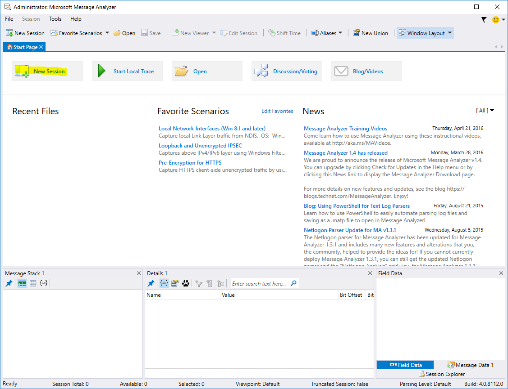
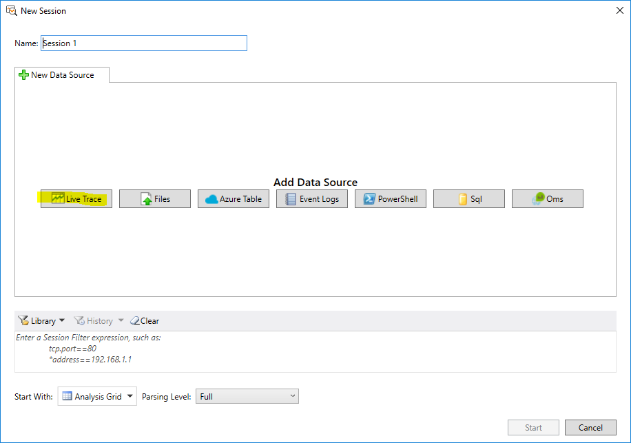
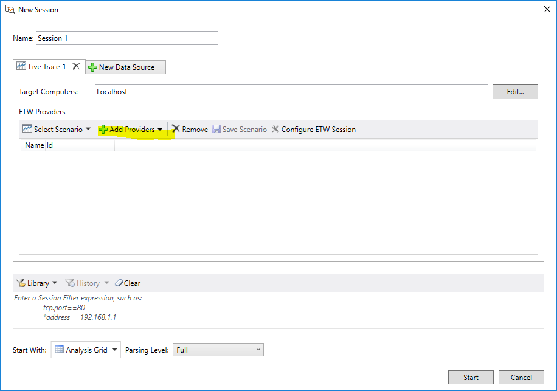
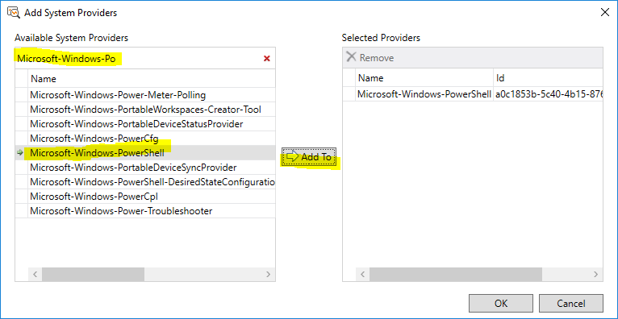
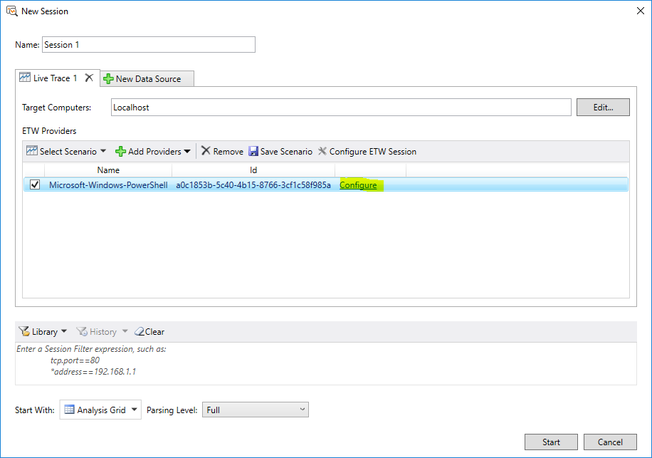
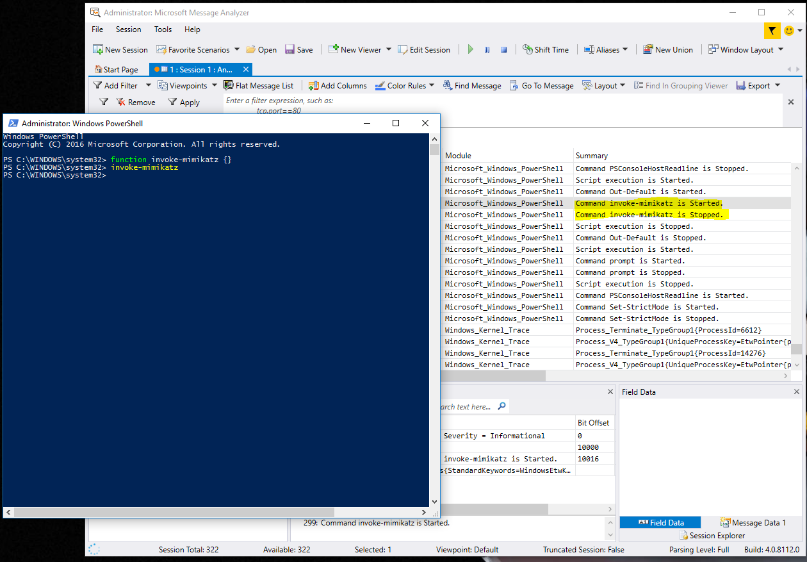
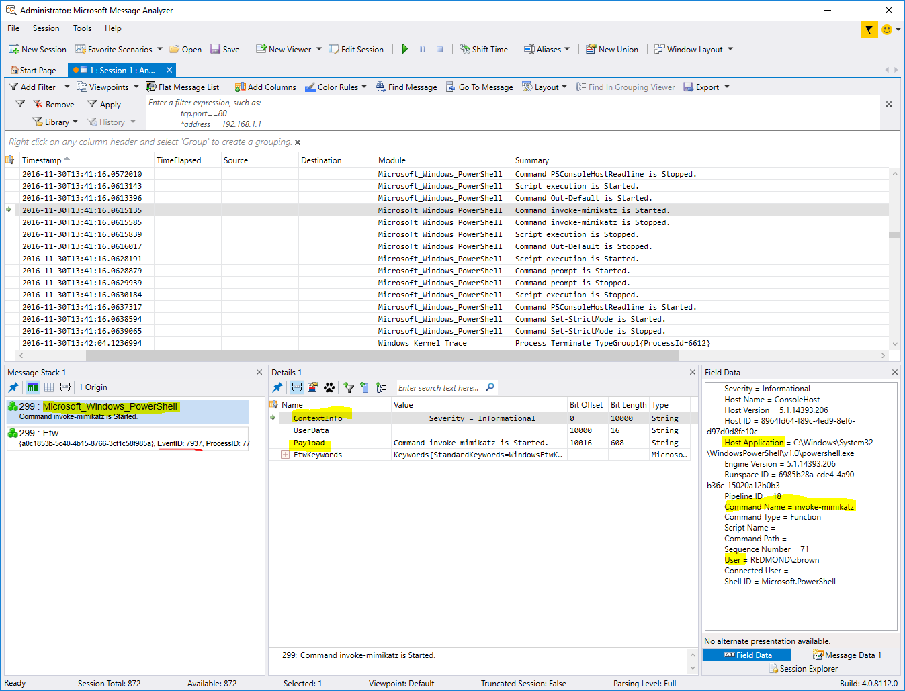

# Using Microsoft Message Analyzer to Find New ETW Sources

In order to make use of krabsetw to consume an ETW provider, you'll first need
to identify the schema of the events therein. This can be achieved with several
different tools but we'll focus on [Microsoft Message
Analyzer](https://www.microsoft.com/en-us/download/details.aspx?id=44226) for
now. If you haven't already installed it, please download and install it from
the link.

When you open Message Analyzer, you should see a screen similar to the
following:

Click the **New Session** button, as highlighted in the image above. You should
then be presented with a dialog that looks like this:

Click the **Live Trace** button, as highlighted in the image above. You should
then be presented with a dialog that looks like this:

Click the **Add Providers** button, as highlighted in the image above. You
should then be presented with a dialog that looks like this:

This dialog allows you to select the provider you're interested in. Typically,
when searching for new sources of ETW events, we'll enter in keywords like
"wininet" or "powershell" and see what providers are available. In this example,
we'll use the PowerShell ETW provider. Once you've found the
Microsoft-Windows-PowerShell provider, select it and click the "Add To" button.

After clicking ok, you should then have a provider added and have a window that
looks as follows:

In the window above, there's an option to configure the provider. This is a bit
of a tricky area with providers. There is no predefined standard on how the
configuration of a provider works but it is comprised of two flags: "All" and
"Any". In other words, the flags are implementation specific. These flags will
allow you to configure what events are actually emit and you will have to play
with them for each provider in order to properly pair down the events emitted.

For now, let's not configure any settings on the "Any" and "All" flags. Click
the "start" button in Message Analyzer

Now open up a powershell window and define a function named "invoke-mimikatz" in
there, similar to the following: `function invoke-mimikatz {}`. Type
`invoke-mimikatz` and hit enter, then switch back to the Message Analyzer
window.

You should roughly have something that looks like the following:

Look for events in the Message Analyzer window where the summary says "Command
invoke-mimikatz is Started". These are the events generated that we're
interested.

When you select that line in Message Analyzer, you should see a window like
this:

Let's talk about the three sections at the bottom now:

* Bottom Left: This is the "message stack" which allows you to see what
"messages" are associated with the event. In general, this is usually just the
event metadata (the second message, "Etw") and the provider specific
information (the first message, "Microsoft_Windows_PowerShell").

* Bottom Center: This window shows the properties associated with the event. In
particular, when you select one of the two messages from the left window, it
will show the properties as associated with that message. The "Etw" message's
relevant fields never change on a given OS - that is, the "Etw" message will
always have the same properties such as: `Id`, `Opcode`, `Flags`, and so on. A
good place to see how these properties are exposed with krabsetw is in the
[EventRecordMetadata](https://github.com/Microsoft/krabsetw/blob/master/O365.Security.Native.ETW/EventRecordMetadata.hpp) class.

* Bottom Left: This windows shows the "field data" which is simply the relevant
value of the property on the event message. If the event property is a
`string` then it's the string value in there and so on.

Now that we've discussed the three panes on the bottom, let's discuss this
particular event that we've selected. This event (id 7937) only contains one
interesting property called `ContextInfo`. This is a reflection of poor event
schema design by the provider authors but that's a discussion for a different
place. You will find that there are other providers that are better at providing
distinct properties in better types than a large string blob.

Now select the `ContextInfo` property and note the content of the bottom right
pane. In there, you'll see `Host Application`, `Command Name`, and `User` which
are relatively self-explanatory and provide us with some particularly interesting pieces of info to parse:

* We can use `Host Application` to identify suspect processes hosting the
PowerShell runtime. In general, we'd only expect to see powershell.exe and
wsmprovhost.exe hosting the PowerShell runtime so any other value would be
suspect.

* The `Command Name` gives us the name of the function invoked. If we have a
prohibited or permitted list we can check whether the command name is
expected.

* The `User` is self-explanatory and gives us the user that started the hosting
process.

## Conclusion

In order to make use of the information above, we'll need to parse out these
lines from the `ContextInfo` string blob. If you're interested in a sample
project to start doing this, please check out the
[PowerShellMethodAuditor](https://github.com/zacbrown/PowerShellMethodAuditor)
project.

Hopefully this will help you explore ETW providers for interesting information.
Please file an issue on [Github](https://github.com/Microsoft/krabsetw/issues)
if you run into any problems with this guide.
